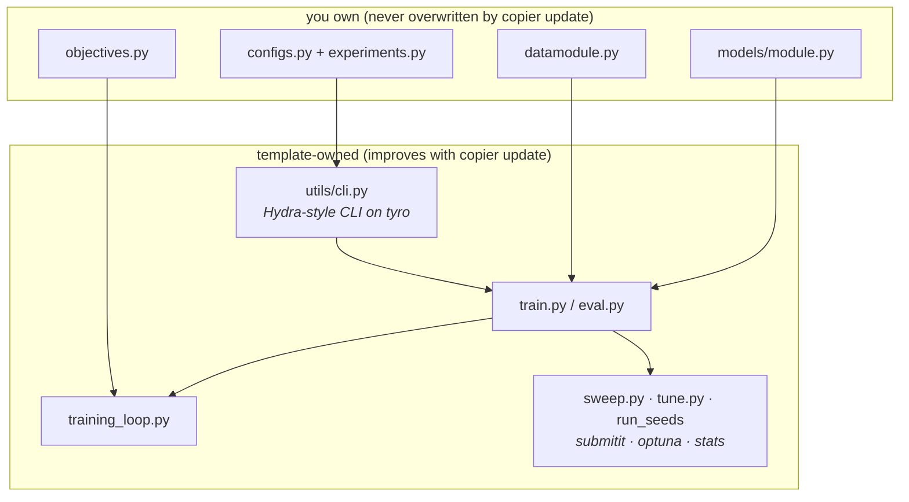

# The stack (and why)

Every tool re-evaluated against the 2026 landscape. One picture first: the
parts you own sit behind two factory seams, everything else is shared
plumbing the template maintains for you.

| Concern | Choice | One-line why |
|---|---|---|
| Packaging | **uv** | Won the ecosystem; lockfiles + CUDA wheel routing built in |
| Config | **pydantic + tyro** (utils/cli.py) | Typed, IDE-checked configs with Hydra's CLI ergonomics kept |
| Sweeps / SLURM | **submitit + optuna** (~150 lines of owned glue) | No frozen plugins; every line readable |
| Training | **Lightning Fabric** (own loop) | Distributed/AMP plumbing without a Trainer black box |
| Framework | **PyTorch** default, **JAX** optional | Ecosystem by default; XLA + explicit keys when a project wants them |
| Caching | **exca + codever** (tabular) | Benchmark cells memoized, keyed to config *and* code version |
| Tracking | **wandb** default, **trackio** local fallback | Best academic UX; a credible local escape hatch |
| Shapes | **jaxtyping + beartype** | Runtime shape checks; bugs die at the first forward pass |
| Lint/format | **ruff** | One fast tool replaces black + isort + flake8 |
| Stats | **scipy** (+ pingouin extra) | Paired Wilcoxon, bootstrap CIs, Cohen's d out of the box |

## Typed configs — and why we left Hydra

This template ran on Hydra until mid-2026. Hydra's last feature release was
early 2023 and its plugin ecosystem froze, while the field moved to typed
configs (torchtitan, LeRobot, nerfstudio). We migrated to **pydantic +
[tyro](https://github.com/brentyi/tyro)** and kept the two things Hydra did
best:

- the free-order `key=value` CLI with group swaps — `experiment=example loss=contrastive model.lr=1e-3` still works verbatim, now typo-checked at parse time
- `${...}` interpolation — replaced by one visible `resolved()` method in code, still supported inside `configs/local.yaml`

What Hydra's launcher/sweeper plugins did is now ~150 lines of owned glue
(`sweep.py`, `tune.py`, `run_dir.py`) on actively maintained deps.

## Lightning Fabric, not Trainer

Research code in 2026 is hand-written loops with a thin distributed layer
underneath — callback frameworks fight you on custom objectives and
`torch.compile`. Fabric does device placement, mixed precision, DDP, and
checkpoint I/O; the loop stays ~75 readable lines, with resume, LR
scheduling, accumulation, and clipping config-driven. The `Objective`
protocol keeps the loop loss-agnostic: any callable
`(model, batch) -> {"loss": ...}` plugs in via `loss=<name>`.

## PyTorch by default, JAX by choice

The ecosystems this template serves are PyTorch-shaped — TabPFN/TabICL,
timm, open_clip, and the sklearn-adoption path all assume torch artifacts.
But nothing in the orchestration layer imports a framework, so
`framework=jax` swaps just the training core: flax NNX model, optax
optimizer (schedule/clipping/accumulation become optimizer composition),
jitted steps. Choose it for small-model/many-step work, TPUs, or
`vmap`-shaped research — details in [JAX](workflows/jax.md).

## exca + codever (tabular flavor)

Benchmark cells are memoized on disk by
[exca](https://github.com/facebookresearch/exca), keyed on the estimator
config, task, fold, seed — **and the code version**. `utils/codever.py`
fingerprints your package's AST at submit time, auto-bumps `0.0.N-<hash>` on
semantic edits, and appends a diff changelog: any cached number traces to
the exact code that produced it, and reverting code resurrects the old
cache. Details in [Tabular benchmarking](workflows/tabular-benchmarking.md).

## Tracking: wandb + trackio

The landscape moved: Neptune shut down (OpenAI acquisition, March 2026);
W&B went to CoreWeave but its free academic tier remains the best UX;
HuggingFace's **trackio** is a local-first, wandb-compatible tracker. The
template keeps trackers swappable (`logger.kind=...`) so vendor risk stays
one config key deep — see [Experiment tracking](workflows/tracking.md).

## jaxtyping + beartype

`Float[Tensor, "batch features"]` annotations are checked at runtime on
every call — the standard cure for silent broadcasting bugs (and
framework-agnostic, despite the name). Dev extras add `lovely-tensors`,
`torchinfo`, and `hypothesis-torch` for property-based tests.

## What we deliberately skip

- **Lightning Trainer / Composer / HF Trainer** — wrong altitude for novel-method research
- **DVC** — OpenML task IDs *are* the data versioning for tabular work; HF Hub for big blobs
- **Multi-node DDP scaffolding** — crib [torchtitan](https://github.com/pytorch/torchtitan) when you need it
- **SkyPilot / snakemake** — watch list; adopt per-project if a need appears
