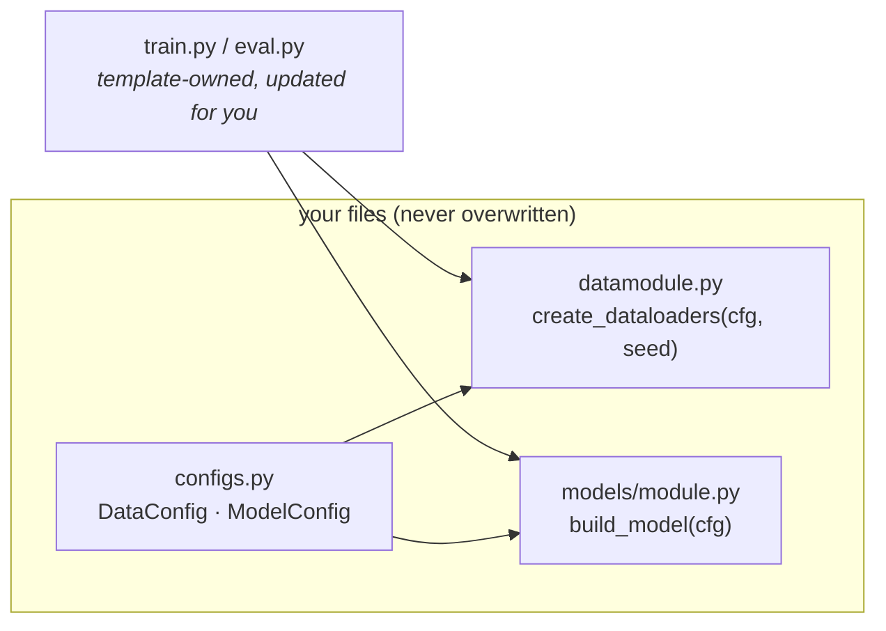

# Tutorial: real data in 15 minutes

Generate a project, swap in a real dataset, and finish with a publication-grade
number — mean accuracy with a bootstrap confidence interval over 5 seeds. Every
command and output below is from an actual run.

We'll predict red-wine quality from 11 physicochemical measurements
([UCI wine quality](https://archive.ics.uci.edu/dataset/186/wine+quality),
1,599 rows — small enough to train on a laptop CPU in seconds).

## 1 · Generate and smoke-test

```bash
uv tool install copier
copier copy --trust gh:loevlie/ml-research-template wine-quality
cd wine-quality
uv run python src/wine_quality/train.py trainer.max_epochs=2
```

That trains the reference MLP on **synthetic data** — proof the pipeline works
before you touch anything.

## 2 · Bring your own data

You edit exactly **two files**, and both are yours — `copier update` never
overwrites them. The entry points (`train.py`, `eval.py`) only ever call two
factory functions, so they stay untouched:



**First**, describe the data in `DataConfig` (`src/wine_quality/configs.py`):

```python title="src/wine_quality/configs.py" hl_lines="2 3 4"
class DataConfig(pydantic.BaseModel):
    csv_path: str = "data/winequality-red.csv"
    n_features: int = 11  # the 11 physicochemical measurements
    n_classes: int = 6  # quality scores 3-8
    batch_size: int = 64
    num_workers: int = 4
    val_split: float = 0.2
```

**Second**, replace the placeholder dataset in
`src/wine_quality/data/datamodule.py`:

```python title="src/wine_quality/data/datamodule.py"
WINE_URL = "https://archive.ics.uci.edu/ml/machine-learning-databases/wine-quality/winequality-red.csv"


class WineQualityDataset(Dataset):
    """UCI red wine quality: 11 physicochemical features -> quality score 3-8."""

    def __init__(self, csv_path: str) -> None:
        path = Path(csv_path)
        if not path.exists():  # download once, cache locally
            path.parent.mkdir(parents=True, exist_ok=True)
            urllib.request.urlretrieve(WINE_URL, path)
        rows = np.loadtxt(path, delimiter=";", skiprows=1)
        x = torch.tensor(rows[:, :-1], dtype=torch.float32)
        self.data = (x - x.mean(0)) / x.std(0)  # standardize features
        self.targets = torch.tensor(rows[:, -1], dtype=torch.long) - 3  # 3-8 -> 0-5

    def __len__(self) -> int:
        return len(self.data)

    def __getitem__(self, idx: int) -> tuple[torch.Tensor, torch.Tensor]:
        return self.data[idx], self.targets[idx]
```

…and point the factory at it (one line in `create_dataloaders`):

```python
    dataset = WineQualityDataset(cfg.csv_path)
```

That's it. The example MLP already reads `n_features`/`n_classes` from the
config, so `models/module.py` needs nothing — when you later bring your own
architecture, you swap it inside `build_model()` the same way.

## 3 · Train

```bash
uv run python src/wine_quality/train.py trainer.max_epochs=30 run_dir=outputs/wine_first
```

```text
------------------------------------------------------------------------
run dir   outputs/wine_first
model     ExampleModel | 18,822 params | lr=0.0003
trainer   max 30 epochs | 32-true | seed=42
loss      SupervisedLossConfig | logger csv
config    outputs/wine_first/config.yaml (full snapshot + git state)
------------------------------------------------------------------------
Epoch   0 | train_loss=1.7181 | val_loss=1.5782 | val_acc=0.5486
Epoch   1 | train_loss=1.4688 | val_loss=1.3398 | val_acc=0.5674
...
Epoch  29 | train_loss=0.8659 | val_loss=0.9371 | val_acc=0.6489
------------------------------------------------------------------------
best      val_loss=0.9370 | val_acc=0.6426
ckpts     outputs/wine_first/best.ckpt (+ last.ckpt)
evaluate  uv run python src/wine_quality/eval.py ckpt_path=outputs/wine_first/best.ckpt
------------------------------------------------------------------------
```

Real data, learning visibly. The `evaluate` line is copy-pasteable:

```bash
uv run python src/wine_quality/eval.py ckpt_path=outputs/wine_first/best.ckpt
```

```text
eval: settings restored from outputs/wine_first/config.yaml
Eval | loss=0.9370 | acc=0.6426
```

Note it restored the training config (including your `csv_path`) from the
run's snapshot — no re-specifying anything, and it reproduces the training-time
numbers exactly.

## 4 · Name the experiment

Promote the settings into a version-controlled preset in
`src/wine_quality/experiments.py`, so the result traces to a commit:

```python title="src/wine_quality/experiments.py"
EXPERIMENTS: dict[str, TrainConfig] = {
    "base": TrainConfig(),
    "wine": TrainConfig(
        model=ModelConfig(lr=1e-3),
        trainer=TrainerConfig(max_epochs=30, patience=10),
    ),
}
```

```bash
uv run python src/wine_quality/train.py experiment=wine
```

## 5 · The publication-grade number

One seed is an anecdote. Run five, get a confidence interval:

```bash
bash scripts/run_seeds.sh experiment=wine seeds="42,123,456,789,1337"
uv run python scripts/aggregate_seeds.py outputs/multi_seed_<stamp> --metric val/acc
```

```text
Metric: val/acc
Seeds:  [123, 1337, 42, 456, 789]
Mean:   0.6213
Std:    0.0285
95% CI: [0.6063, 0.6583]
```

That's the line that goes in the paper: **0.621 ± 0.029 (5 seeds)** — and when
you have a baseline to beat, run it with the *same seeds* and pass
`--baseline` to get the paired Wilcoxon test and effect size
([details](workflows/multi-seed-stats.md)).

## Where to go from here

<div class="grid cards" markdown>

-   :material-tune-variant:{ .middle } **Find better hyperparameters** —
    grid sweeps and Optuna search, locally or as SLURM arrays.
    [:octicons-arrow-right-24: Sweeps & HP search](workflows/sweeps.md)

-   :material-server:{ .middle } **Move to the cluster** — the same commands,
    preemption-proof.
    [:octicons-arrow-right-24: Run on SLURM](workflows/slurm.md)

-   :material-chart-line:{ .middle } **Watch runs live** — switch trackers with
    one flag (`logger.kind=wandb`).
    [:octicons-arrow-right-24: Experiment tracking](workflows/tracking.md)

-   :material-swap-horizontal:{ .middle } **Custom objectives** — contrastive,
    masked, anything: swap the loss without touching the loop.
    [:octicons-arrow-right-24: Train & experiment](workflows/training.md)

</div>
