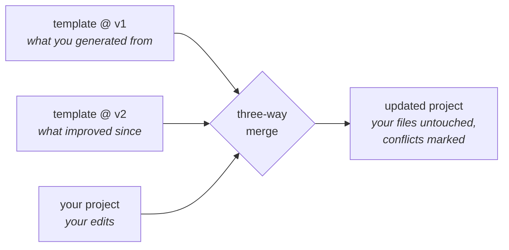

# Updating projects

The template improves; your projects can follow. This is the reason to use Copier over a "Use this template" button — and the compounding win when you run several projects off one template.

```bash
cd path/to/existing-project
copier update --trust
```

Copier reads `.copier-answers.yml` (your original answers + template version), computes a three-way merge between the old template, the new template, and your project, and applies it:



## What's protected

Files you own are listed in the template's `_skip_if_exists` and are **never overwritten** on update — your model, datamodule, objectives, sklearn wrapper, experiment configs, README. Everything else (CI workflows, pre-commit config, training-loop improvements, new scripts) updates in place.

## Handling conflicts

Where the template and your edits touch the same lines, Copier leaves standard conflict markers or `.rej` files:

```bash
grep -rn "<<<<<<<" . --include="*.py" --include="*.yaml"   # find conflict markers
```

Resolve them like any merge, run the tests, commit.

## Changing your answers

Re-run with new answers (e.g. switching default logger, or adopting a flavor):

```bash
copier update --trust -d logger=trackio   # changes the default tracker
copier update --trust -d flavor=tabular     # adds the benchmark harness to an existing project
```

## Versioning discipline

- Commit (or stash) before `copier update` — it refuses to run on a dirty tree.
- Update one project soon after improving the template; conflicts are smallest while changes are fresh.
- The answers file records the template commit, so `git log` in the template repo tells you exactly what an update will bring.
