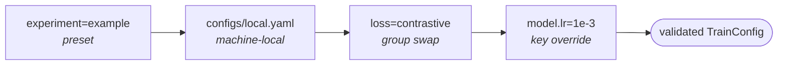

# Configure with typed configs

Configs are **pydantic models in `src/<pkg>/configs.py`** — typed, IDE-navigable, and validated. CLI parsing (`utils/cli.py`, one ~250-line file on [tyro](https://github.com/brentyi/tyro)) keeps the Hydra-style syntax, so commands read exactly as before:

```bash
uv run python src/<pkg>/train.py experiment=example loss=contrastive model.lr=1e-3
```

The difference is *when errors happen*: a typo'd key now dies at parse time with a suggestion, and your editor autocompletes config fields.

## Layout

```
src/<pkg>/configs.py       # the schema: DataConfig, ModelConfig, TrainerConfig, ...
src/<pkg>/experiments.py   # named presets (replaces configs/experiment/*.yaml)
configs/local.yaml         # machine-local overrides (gitignored)
```

## The four override levels

Composition order (later wins): **preset → local.yaml → group swap → CLI key**.



1. **Preset** — `experiment=example` selects a full config from `experiments.py`.
2. **Machine-local** — `configs/local.yaml` (gitignored) applies on every run:
   ```yaml
   data:
     num_workers: 0   # laptop
   ```
3. **Group swap** — `loss=contrastive` replaces a whole typed config block. Variants are registered in `GROUPS` in `configs.py`.
4. **Key override** — `model.lr=1e-3 trainer.max_epochs=50`, any nesting depth, free order.

## Experiments are Python now

```python title="src/<pkg>/experiments.py"
EXPERIMENTS = {
    "base": TrainConfig(),
    "example": TrainConfig(
        data=DataConfig(batch_size=128),
        model=ModelConfig(hidden_dim=256, lr=1e-3),
        trainer=TrainerConfig(max_epochs=50),
    ),
}
```

Building variants is ordinary code — `model_copy(update=...)`, loops over widths, helper functions — no YAML inheritance rules. Diffs in PRs stay just as reviewable, and pyright checks every preset.

## Derived values (the `${...}` replacement)

Fields that used to interpolate (`n_features: ${data.n_features}`) are now `None`-defaulted and filled in one visible place:

```python title="configs.py"
class ModelConfig(pydantic.BaseModel):
    n_features: int | None = None   # derived from DataConfig unless set

class TrainConfig(pydantic.BaseModel):
    def resolved(self) -> "TrainConfig":
        cfg = self.model_copy(deep=True)
        if cfg.model.n_features is None:
            cfg.model.n_features = cfg.data.n_features
        return cfg
```

Inside `configs/local.yaml`, literal `${a.b}` strings still work — they resolve against the composed config:

```yaml
model:
  hidden_dim: ${data.n_features}
```

## Adding a swappable variant

1. Define a config class with a `build()` in `configs.py`:
   ```python
   class MaskedLossConfig(pydantic.BaseModel):
       mask_ratio: float = 0.15
       def build(self):
           return MaskedColumnObjective(mask_ratio=self.mask_ratio)
   ```
2. Add it to the union and register it: `GROUPS["loss"]["masked"] = MaskedLossConfig`.
3. `loss=masked loss.mask_ratio=0.3` now works on every entry point.

## Reproducibility

Every run writes `config.yaml` into its run directory — the fully-resolved config plus git SHA, dirty flag, and the exact argv (`utils/run_dir.py`). Re-running a result months later is a file read, not archaeology.

!!! tip "Debugging composition"
    `python train.py --help` lists every flag with its current default, plus the available experiments and group variants.
