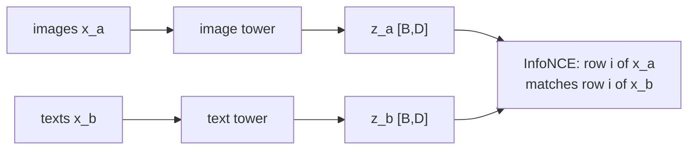

# Multimodal

*Requires the `multimodal` flavor* (adds `timm`, `open_clip_torch`, `transformers`, `datasets`).

## Image-text data

`src/<pkg>/data/image_text.py` builds `(images, token_ids)` loaders from any HF Hub dataset, with preprocessing matched to an open_clip backbone:

```python
from <pkg>.data.image_text import create_image_text_dataloader

loader = create_image_text_dataloader(
    dataset_name="nlphuji/flickr30k",
    batch_size=64,
    streaming=True,          # stream from the hub instead of downloading
)
```

### The escalation path

Start simple; move down only when it hurts:

1. **HF `datasets`** (this file) — fine to a few hundred GB, especially with streaming.
2. **LitData / MosaicML StreamingDataset** — cloud-resident shards, deterministic mid-epoch resume; for serious pretraining throughput.
3. **WebDataset tar shards** — the most interoperable archival format.

## Contrastive training

`ContrastiveObjective` (in every project's `objectives.py`) is symmetric InfoNCE — CLIP-style:



It expects pairs and a two-tower model:

```python
class TwoTower(nn.Module):
    def forward(self, x_a, x_b):
        return self.image_encoder(x_a), self.text_encoder(x_b)   # two [B, D] embeddings
```

```bash
uv run python src/<pkg>/train.py loss=contrastive
```

The training loop doesn't change — that's the point of the [Objective protocol](training.md#swap-the-objective). The same objective covers SimCLR-style single-modality SSL (two augmented views) — including tabular SSL with column-corruption views.

## Backbones

- **timm** for vision encoders: `timm.create_model("vit_base_patch16_224", pretrained=True, num_classes=0)`
- **open_clip** for pretrained CLIP towers and tokenizers: `open_clip.create_model_and_transforms("ViT-B-32", pretrained="openai")`
- **transformers** for text encoders.

Compose them inside your `models/module.py` two-tower module; keep the `@jaxtyped` shape annotations on `forward` so embedding-dim mismatches fail fast.

!!! tip "Mixed precision"
    Contrastive pretraining is bandwidth-hungry — set `trainer.precision=bf16-mixed` on Ampere+ GPUs, and use `trainer.accumulate_grad_batches` to reach contrastive-friendly effective batch sizes on small cards.
