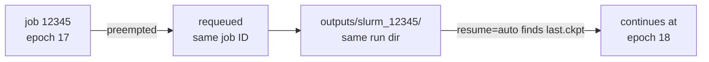

# SLURM, checkpoints & resume

Two complementary paths ship with every project: Python launchers (submitit)
for sweeps and HP search, and plain sbatch scripts for everything else. Both
survive preemption without babysitting.

## Path 1 — submitit launchers

`scripts/sweep.py` and `scripts/tune.py` take `--cluster slurm` and become
job arrays — commands and details in [Sweeps & HP search](sweeps.md).

## Path 2 — sbatch scripts (no extra deps, fully inspectable)

```bash
sbatch scripts/sbatch_train.sh experiment=example     # single job, single/multi-GPU
sbatch scripts/sbatch_seeds.sh experiment=example     # array job: one seed per task
```

Both assume `.venv/` exists on a shared filesystem (`uv sync --extra dev --extra cluster` on the login node). Extra args are forwarded to `train.py` in the same `key=value` syntax.

## What gets saved

Every epoch, the loop writes two checkpoints to the run directory:

| File | When | Contents |
|---|---|---|
| `best.ckpt` | val loss improved | model, optimizer, scheduler, epoch, best metrics, patience |
| `last.ckpt` | every epoch | same — the resume point |

## Resuming

```bash
# pick up last.ckpt from this run dir if present (no-op otherwise)
uv run python src/<pkg>/train.py run_dir=outputs/myrun trainer.resume=auto

# resume from an explicit checkpoint
uv run python src/<pkg>/train.py trainer.resume=outputs/<run>/last.ckpt
```

```text
Resumed from outputs/myrun/last.ckpt (epoch 1)
Epoch   2 | train_loss=2.2795 | val_loss=2.2928 | val_acc=0.0900
```

Resume restores the epoch counter, best-metric tracking, early-stopping
patience, optimizer moments, and scheduler position — training continues as
if never interrupted (modulo dataloader order within the epoch).

!!! warning "Keep the trainer config consistent"
    A checkpoint saved with `scheduler.name=cosine` must be resumed with the
    same scheduler (and vice versa) — state-dict keys are matched strictly.

## Preemption survival — built in

The sbatch scripts pin each run's directory to the job ID and pass
`trainer.resume=auto`, so a preempted job heals itself:



Granularity is one epoch; if your epochs are hours long, also wire
Lightning's `SLURMEnvironment(auto_requeue=True)` for the SIGUSR1-based
mid-epoch save (the scripts already send `--signal=B:USR1@90`).

## Tabular flavor: array benchmarks

Tabular-FM evaluation is hundreds of small CPU jobs, not one big GPU run. `scripts/sbatch_benchmark.sh` maps an estimator × task × fold grid onto one SLURM array, and exca's cache means a re-submitted grid recomputes only missing cells — see [Tabular benchmarking](tabular-benchmarking.md).

## Cluster notes

- **Logger on air-gapped compute nodes:** `WANDB_MODE=offline` + `wandb sync` from the login node, or `logger.kind=trackio` / `logger.kind=csv` — see [Tracking](tracking.md).
- **Multi-node DDP:** out of scope for these scripts; use the `scontrol show hostnames` + `torchrun --rdzv-backend=c10d` pattern from the [PyTorch examples](https://github.com/pytorch/examples/tree/main/distributed/ddp-tutorial-series/slurm).
- **Containers:** with Pyxis/Enroot, add the container flags to the sbatch scripts directly — they're plain bash.
- **Evaluating a checkpoint:** `eval.py ckpt_path=...` loads just the model weights from any checkpoint, regardless of the extra training state inside.
