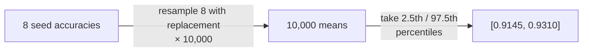

# Statistics, explained

What the numbers in the [aggregator output](multi-seed-stats.md) actually
tell you, one at a time — using this run as the example:

```text
Mean:   0.9234 ± 0.0045          95% CI: [0.9145, 0.9310]
Delta:  +0.0322  |  Wilcoxon signed-rank, p=0.0079  |  Cohen's d = 6.712
```

## Why seeds at all

Re-running identical code with a different seed changes the init, the data
order, and (on GPU) kernel nondeterminism — and the metric moves. That
movement here is `± 0.0045`: any single-seed improvement smaller than a
couple of those is indistinguishable from luck. Picard ran ImageNet
training across 10⁴ seeds and found the spread alone spans what papers
routinely claim as a contribution
([torch.manual_seed(3407) is all you need](https://arxiv.org/abs/2109.08203)).

## Bootstrap confidence interval

**What it gives you:** a range for where the *true mean* accuracy plausibly
lies, given only your N seed results — no assumption that they're
normally distributed (with 5–10 seeds, normality is exactly what you can't
check).



Reading it: if the whole experiment were repeated many times, ~95% of CIs
built this way would contain the true mean. **Caveat:** it's a CI for the
*mean*, not a range for individual runs — and with very few seeds it gets
optimistically narrow, which is one reason 5 is the floor, not the goal.

<div class="ix-card" id="ix-bootstrap"></div>

## Paired tests — and why the same seeds

The question a significance test answers: *could a delta this size happen
by seed luck alone?* Pairing makes the test sharp: because both methods ran
on the **same seeds**, each seed contributes one difference
(`ours − baseline`), and seed-to-seed variance — the biggest noise source —
cancels out entirely.

**Wilcoxon signed-rank** ranks those differences and checks whether they
consistently favor one side. It uses no normality assumption and one
outlier seed can't dominate it. The price of that robustness: with N pairs
the smallest possible two-sided p is `2/2^N` — at 5 seeds that's 0.0625, so
significance at 0.05 is *mathematically unreachable*. That's why the
aggregator falls back to a **paired t-test** below 6 seeds (stronger
assumptions, but it can at least speak). Our `p=0.0079` is the 8-seed
minimum: the delta favored "ours" on all 8.

<div class="ix-card" id="ix-seeds"></div>

## Cohen's d

p answers "is it real?"; **d answers "is it big?"** — the delta measured in
units of run-to-run standard deviation. `d = 6.7` means the gap is ~7× the
noise: the two distributions barely overlap (by convention 0.8 is already
"large"). ML deltas often post huge d because seed-noise is small; the
embarrassing case d protects you from is the opposite — a tiny-but-
significant p hiding a difference too small to matter. With few seeds, d
itself is noisy: report it, don't worship its second decimal.

## Further reading

- [Deep RL at the Edge of the Statistical Precipice](https://arxiv.org/abs/2108.13264) (NeurIPS 2021) — the case for CIs over point estimates in ML, plus [rliable](https://github.com/google-research/rliable)
- [The Hitchhiker's Guide to Testing Statistical Significance in NLP](https://aclanthology.org/P18-1128/) (ACL 2018) — choosing the right test, incl. Wilcoxon vs t-test
- [Accounting for Variance in Machine Learning Benchmarks](https://arxiv.org/abs/2103.03098) (MLSys 2021) — what seed variance does to benchmark conclusions
- [Statistics Done Wrong](https://www.statisticsdonewrong.com/) — short, free book on the classic inference mistakes
- [Bootstrapping (Wikipedia)](https://en.wikipedia.org/wiki/Bootstrapping_(statistics)) — the method behind the CI
