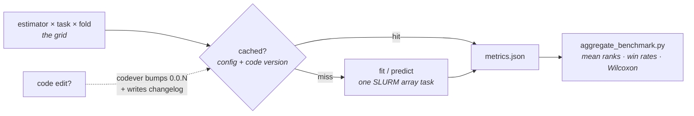

# Tabular benchmarking

*Requires the `tabular` flavor.*

Tabular foundation-model research has an unusual shape: evaluation is **hundreds of small fit/predict jobs** (estimator × dataset × fold), not one big training run. The flavor ships that harness end-to-end:



A partial array failure costs one rerun, not the grid; a semantic code edit invalidates exactly the cells it should.

## The pieces

```
src/<pkg>/data/openml_data.py   # OpenML task → TaskSplit (standardized CV folds)
src/<pkg>/sklearn_wrapper.py    # your torch model behind fit/predict_proba
src/<pkg>/benchmark.py          # typed estimator configs + one cell → metrics.json
scripts/run_benchmark.sh        # local grid loop
scripts/sbatch_benchmark.sh     # the same grid as one SLURM array
scripts/aggregate_benchmark.py  # tables, mean ranks, win rates, paired Wilcoxon
```

## Why OpenML tasks

A task ID pins the dataset *and* its 10-fold CV splits — `task_id=31, fold=0` means the same evaluation on every machine, forever. Task IDs are the data versioning. Suites give you curated dataset collections:

```python
from <pkg>.data.openml_data import tasks_in_suite
tasks_in_suite("OpenML-CC18")     # 72 classification tasks
```

(TabArena — the field's living benchmark — builds on the same task infrastructure.)

## Run one cell

```bash
uv run python src/<pkg>/benchmark.py estimator=logreg task_id=31 fold=0
# credit-g (task 31, fold 0): acc=0.6800 balanced_acc=0.5714 fit=0.0s
```

Each cell writes `metrics.json` (acc, balanced acc, ROC AUC, log loss, fit/predict time) into its run dir.

## Run the grid

Edit the grid at the top of the script (estimators, task IDs, folds), then:

```bash
bash scripts/run_benchmark.sh                 # locally, sequential
sbatch scripts/sbatch_benchmark.sh            # SLURM array, one cell per task (CPU-sized by default)
```

## Aggregate

```bash
uv run python scripts/aggregate_benchmark.py outputs/benchmark_<id> --baseline logreg
```

```text
=== acc (mean over folds) ===
estimator  logreg    mlp  tabpfn
credit-g     0.69   0.70   0.77
...

=== Mean rank across datasets (lower is better) ===
tabpfn 1.2   mlp 2.1   logreg 2.7

--- tabpfn vs logreg (30 datasets) ---
Win rate: 87%
Test: Wilcoxon signed-rank, p=0.0001 ...
```

Mean ranks, win rates, and the paired Wilcoxon across datasets are the standard cross-dataset summary in tabular-FM papers; the aggregator reuses the same `utils/stats.py` as the [multi-seed pipeline](multi-seed-stats.md) — here each *dataset* is a pair, so the test asks whether the win pattern across 30 datasets could be luck ([what the numbers mean](stats-explained.md)).

## Ship your model the way the field expects

`sklearn_wrapper.py` shows the pattern: your torch model behind `BaseEstimator` (`fit/predict/predict_proba`, params stored verbatim, fitted state in `*_` attributes). That makes it a drop-in for this harness, sklearn CV, and **everyone else's eval code** — it's how TabPFN and TabICL got adopted. The flavor's tests include the sklearn-clone contract and a hypothesis-based row-permutation-invariance property test (the kind of invariant in-context tabular models must satisfy).

## Cached cells (built in)

Each cell's result is memoized on disk by [exca](https://github.com/facebookresearch/exca), keyed on (estimator config, task, fold, seed, **code version**). Re-running a grid recomputes only missing cells — a partial SLURM-array failure costs one rerun, not the whole grid. Disable per-run with `cache.enabled=false`.

The code-version key comes from `utils/codever.py`: it fingerprints the AST-normalized source of your package at submit time (comments/formatting/docstring edits never invalidate; semantic edits do) and auto-bumps `0.0.N-<hash>`, appending a unified diff of what changed to `cache/benchmark/code_versions/CHANGELOG.md`:

```
## 0.0.2-bdc33bb5 — 2026-06-11 — git 8c3c5d1 (dirty)
> switched to balanced sampling
-def train_step(model, batch, lr=3e-4):
+def train_step(model, batch, lr=1e-3, accumulate=2):
```

Months later, any cached number traces to the exact code diff that produced it. Reverting code (e.g. `git checkout` of last month's commit) reproduces the old fingerprint and **resurrects the old cache** — no pinning needed. Annotate bumps with `CODEVER_NOTE="why"`.

Estimators are typed configs in `benchmark.py` — `estimator=mlp estimator.hidden_dim=64` swaps and overrides them with parse-time checking; add your own by defining a config class with a `build()` and registering it in `ESTIMATORS`.

!!! warning "What the fingerprint does NOT see"
    Dependency upgrades, data files, and notebook code don't bump the version — documented out of scope. After a `torch`/`sklearn` upgrade, force-recompute critical cells once (`--infra.mode=force` semantics live on for exactly this).

## Foundation-model baselines

```bash
uv sync --extra tabular-baselines
uv run python src/<pkg>/benchmark.py estimator=tabpfn task_id=31
uv run python src/<pkg>/benchmark.py estimator=tabicl task_id=31
```

!!! warning "Licenses"
    **TabPFN** weights are licensed for non-commercial research use. **TabICL** is fully open (weights + pretraining code) — the better base if you plan to modify the pretraining itself.
