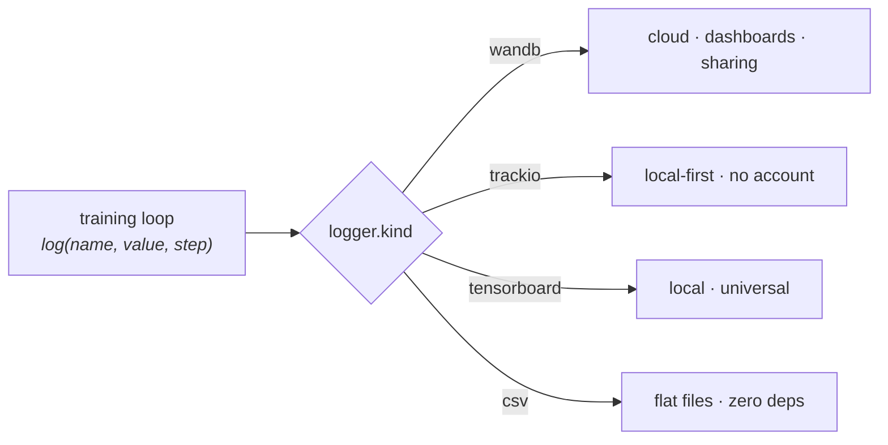

# Experiment tracking

Trackers sit behind one config key — pick a default at template time, switch any run with `logger.kind=<name>`:



```bash
uv run python src/<pkg>/train.py logger.kind=wandb        # cloud, collaboration
uv run python src/<pkg>/train.py logger.kind=trackio      # local-first, no account
uv run python src/<pkg>/train.py logger.kind=tensorboard  # local, basic
uv run python src/<pkg>/train.py logger.kind=csv          # flat files, zero deps
```

## wandb (default)

The free **academic tier** still gives Pro-level features, unlimited tracked hours, and team seats — the best UX for paper-trail experiments and sharing dashboards with an advisor. (W&B was acquired by CoreWeave in 2025; terms unchanged so far. That platform risk is why the template keeps trackers swappable.)

```bash
uv sync --extra tracking-wandb
uv run wandb login
```

### Offline SLURM nodes

Compute nodes often have no internet. Run offline, sync from the login node:

```bash
WANDB_MODE=offline sbatch scripts/sbatch_train.sh ...
wandb sync outputs/slurm_*/wandb/offline-run-*        # later, from the login node
```

For live syncing during long runs, see [wandb-osh](https://github.com/klieret/wandb-offline-sync-hook) (a small hook that relays through the head node).

## trackio (local fallback)

HuggingFace's local-first tracker with a wandb-compatible API: runs live in a local SQLite db, the dashboard is one command, no account or cloud involved — good for sensitive data and air-gapped clusters.

```bash
uv sync --extra tracking-trackio
uv run python src/<pkg>/train.py logger.kind=trackio
uv run trackio show                                   # dashboard
```

Fabric has no built-in trackio logger, so the template ships a ~50-line adapter (`src/<pkg>/utils/trackio_logger.py`). Optionally pass `space_id` to the adapter in `LoggerConfig.build()` (configs.py) to mirror the dashboard to a HF Space.

## tensorboard / csv

`tensorboard` needs no introduction (`tensorboard --logdir=outputs`). `csv` writes plain `metrics.csv` per run — zero dependencies, trivially parseable, and always there as ground truth (the multi-seed pipeline reads `metrics.json` regardless of logger).

## What gets logged

The loop logs `train/loss_step`, `train/lr`, `train/grad_norm` (pre-clip total norm, every 10 batches when clipping is enabled), `train/loss_epoch`, `val/loss`, `val/acc` (when the objective emits logits/targets). Add metrics by extending `validate()` in `training_loop.py` — there's no callback indirection to fight.

!!! info "Why not Aim / Neptune / MLflow?"
    Neptune shut down after its OpenAI acquisition (March 2026). Aim's development stalled (Aim 4 never landed), so the template dropped it in favor of trackio. MLflow is healthy but heavier than a solo-researcher needs; the Fabric-logger seam makes it a ~40-line adapter if your lab standardizes on it.
