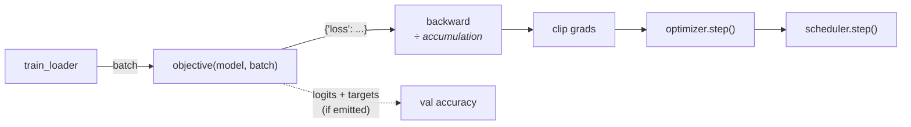

# Train & experiment

## The moving parts

```
src/<pkg>/configs.py          # typed config schema (pydantic) + GROUPS registry
src/<pkg>/experiments.py      # named presets
src/<pkg>/train.py            # thin orchestrator: parse → build → loop; exposes run(cfg)
src/<pkg>/training_loop.py    # train_epoch() + validate() — plain functions, no config inside
src/<pkg>/objectives.py       # loss + forward bundled as a swappable callable
src/<pkg>/data/datamodule.py  # YOUR data, behind create_dataloaders(cfg, seed)
src/<pkg>/models/module.py    # YOUR model, behind build_model(cfg)
```

`train.py` builds everything from the config and calls the loop; the loop never parses config, so it's testable with plain arguments. Your data and model live behind two factory functions — replace their bodies and the entry points never need editing (the [tutorial](../tutorial.md) shows this with a real dataset). Read those files once — they're short by design.

One batch through the loop:



The loop only ever sees the `"loss"` key — that's why swapping objectives never touches it.

## Run things

```bash
uv run python src/<pkg>/train.py                          # base preset
uv run python src/<pkg>/train.py model.lr=1e-3 seed=123   # override anything (typo-checked)
uv run python src/<pkg>/train.py experiment=example       # named preset
uv run python src/<pkg>/train.py trainer.precision=bf16-mixed trainer.max_epochs=200
uv run python src/<pkg>/train.py --help                   # every flag + presets + variants
```

Each run writes to `outputs/<date>/<time>/` (pin with `run_dir=...`): `config.yaml` (resolved config + git state + argv), `best.ckpt`, `last.ckpt`, `metrics.json` (consumed by the [multi-seed aggregator](multi-seed-stats.md)), and logger output.

## Experiments as presets

An experiment is a typed preset in `experiments.py` — version-controlled, so every paper number traces to a commit:

```python title="src/<pkg>/experiments.py"
EXPERIMENTS = {
    "base": TrainConfig(),
    "wider_net": TrainConfig(
        model=ModelConfig(hidden_dim=512, lr=1e-3),
        trainer=TrainerConfig(max_epochs=50),
    ),
}
```

```bash
uv run python src/<pkg>/train.py experiment=wider_net
```

## Swap the objective

The loop calls `objective(model, batch)` and uses the returned `"loss"` — nothing else. To add a self-supervised / contrastive / masked objective:

```python title="src/<pkg>/objectives.py"
class MaskedColumnObjective:
    def __init__(self, mask_ratio: float = 0.15) -> None:
        self.mask_ratio = mask_ratio

    def __call__(self, model, batch):
        x, _ = batch
        x_masked, target, mask = mask_columns(x, self.mask_ratio)
        loss = F.mse_loss(model(x_masked)[mask], target[mask])
        return {"loss": loss}   # no logits/targets → val accuracy auto-skips
```

```python title="src/<pkg>/configs.py"
class MaskedLossConfig(pydantic.BaseModel):
    mask_ratio: float = 0.15
    def build(self):
        return MaskedColumnObjective(mask_ratio=self.mask_ratio)

GROUPS["loss"]["masked"] = MaskedLossConfig   # and add to the LossConfig union
```

```bash
uv run python src/<pkg>/train.py loss=masked loss.mask_ratio=0.3
```

A CLIP-style `ContrastiveObjective` ships in every project as a worked example (`loss=contrastive` — needs a pair-yielding DataLoader and a two-tower model).

## Trainer knobs

```python title="configs.py — TrainerConfig"
precision: "32-true"            # bf16-mixed for modern GPUs
max_epochs: 100
patience: 10                    # early stopping
accumulate_grad_batches: 1      # emulate larger batches
gradient_clip_val: 1.0          # max grad norm per step; None disables
resume: None                    # "auto" | /path/to/last.ckpt — see Checkpoints & resume
scheduler: name="none"          # cosine | constant — warmup + per-step stepping
```

## Evaluate a checkpoint

```bash
uv run python src/<pkg>/eval.py ckpt_path=outputs/<run>/best.ckpt
```

## Built-in sanity tests

`uv run pytest` runs the research smoke tests: the model overfits a single batch, the init loss matches `-log(1/n_classes)`, shapes are right, loaders split reproducibly. Keep these passing — they catch the boring bugs that eat GPU-days.
